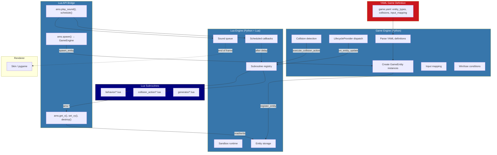

# Lua Engine & Game Engine Architecture

This document describes the layered architecture of the Lua scripting engine and its integration with the YAML-driven game engine.

## Overview

The system provides a data-driven game framework where:
- **Game definitions** come from YAML (entities, behaviors, collisions, win/lose conditions)
- **Entity logic** is implemented in Lua scripts (behaviors, collision actions, generators)
- **Python** handles rendering, input, physics orchestration, and lifecycle management

This architecture enables creating new games primarily through configuration rather than code.

## Architectural Layers

```
┌─────────────────────────────────────────────────────────────────────────┐
│                         YAML GAME DEFINITION                            │
│  game.yaml: entity_types, collision_behaviors, input_mapping, etc.      │
└────────────────────────────────┬────────────────────────────────────────┘
                                 │
                                 ↓
┌─────────────────────────────────────────────────────────────────────────┐
│                    GAME ENGINE (Python)                                 │
│  ams/games/game_engine/engine.py                                        │
│                                                                         │
│  Responsibilities:                                                      │
│  - Parse YAML game definitions                                          │
│  - Create and manage GameEntity instances                               │
│  - Implement LifecycleProvider protocol                                 │
│  - Handle collision detection (AABB)                                    │
│  - Apply input mapping from config                                      │
│  - Check win/lose conditions                                            │
│  - Dispatch lifecycle events to behaviors                               │
└────────────────────────────────┬────────────────────────────────────────┘
                                 │
                                 ↓
┌─────────────────────────────────────────────────────────────────────────┐
│                     LUA ENGINE (Python + Lua)                           │
│  ams/lua/engine.py                                                      │
│                                                                         │
│  Responsibilities:                                                      │
│  - Maintain Lua runtime with sandbox protections                        │
│  - Store entities dictionary                                            │
│  - Load and manage Lua subroutines by type                              │
│  - Execute collision actions, input actions, generators                 │
│  - Manage scheduled callbacks and sound queue                           │
│  - Track elapsed time and score                                         │
└────────────────────────────────┬────────────────────────────────────────┘
                                 │
                                 ↓
┌─────────────────────────────────────────────────────────────────────────┐
│                        LUA API BRIDGE                                   │
│  ams/lua/api.py (base) + ams/games/game_engine/api.py (game)           │
│                                                                         │
│  Exposes Python functionality to Lua via ams.* namespace:               │
│  - Entity access (get_x, set_vy, destroy, etc.)                        │
│  - Property system (get_prop, set_prop, get_config)                    │
│  - Spawning (spawn → routed to GameEngine)                             │
│  - Queries (get_entities_by_tag, count_entities_by_tag)                │
│  - Events (play_sound, schedule)                                        │
│  - Math helpers (sin, cos, random_range, clamp)                        │
└────────────────────────────────┬────────────────────────────────────────┘
                                 │
                                 ↓
┌─────────────────────────────────────────────────────────────────────────┐
│                      LUA SUBROUTINES                                    │
│  lua/behavior/*.lua, lua/collision_action/*.lua, lua/generator/*.lua   │
│                                                                         │
│  Subroutine Types:                                                      │
│  - behavior: Entity lifecycle (on_spawn, on_update, on_destroy)        │
│  - collision_action: Two-entity interactions (execute(a, b, mod))      │
│  - generator: Property value computation (generate(args))              │
│  - input_action: User input handlers (execute(x, y, args))             │
└─────────────────────────────────────────────────────────────────────────┘
```

## Process Flow



## Entity Abstraction Hierarchy

```
┌─────────────────────────────────────────────────────────────────┐
│  Entity ABC (ams/lua/entity.py)                                 │
│                                                                 │
│  Minimal contract for LuaEngine:                                │
│  - id: str           (unique identifier)                        │
│  - entity_type: str  (type name from YAML)                     │
│  - alive: bool       (lifecycle state)                          │
│  - properties: dict  (arbitrary script state)                   │
└──────────────────────────────┬──────────────────────────────────┘
                               │ extends
                               ↓
┌─────────────────────────────────────────────────────────────────┐
│  GameEntity (ams/games/game_engine/entity.py)                   │
│                                                                 │
│  Game-specific attributes:                                      │
│  Transform:     x, y, width, height, vx, vy                    │
│  Visual:        sprite, color, visible                          │
│  State:         health, spawn_time, tags                        │
│  Hierarchy:     parent_id, parent_offset, children              │
│  Behaviors:     behaviors: list[str], behavior_config: dict     │
│                                                                 │
│  Computed properties via get_property():                        │
│  - damage_ratio, health_ratio, age, heading, facing            │
└─────────────────────────────────────────────────────────────────┘
```

**Key Principle**: Lua always operates on entities via string IDs, never direct Python object references. This maintains the sandbox boundary.

## Lifecycle Provider Protocol

The `LifecycleProvider` protocol defines how lifecycle events flow from LuaEngine to GameEngine and ultimately to Lua behaviors:

```python
class LifecycleProvider(Protocol):
    def on_entity_spawned(self, entity: Entity, lua_engine: LuaEngine) -> None: ...
    def on_entity_update(self, entity: Entity, lua_engine: LuaEngine, dt: float) -> None: ...
    def on_entity_destroyed(self, entity: Entity, lua_engine: LuaEngine) -> None: ...
    def dispatch_lifecycle(self, hook_name: str, entity: Entity, lua_engine: LuaEngine, *args) -> None: ...
    def dispatch_scheduled(self, callback_name: str, entity: Entity, lua_engine: LuaEngine) -> None: ...
```

GameEngine implements this protocol to dispatch events to entity-attached behaviors:

```python
# GameEngine._dispatch_to_behaviors()
for behavior_name in entity.behaviors:
    behavior = lua_engine.get_subroutine('behavior', behavior_name)
    method = getattr(behavior, method_name, None)  # e.g., 'on_update'
    if method:
        method(entity.id, *args)  # Always pass entity_id, never the object
```

## Data Flow Diagrams

### Entity Creation Flow

```
GameEngine.spawn_entity(entity_type, x, y, ...)
          │
          ├─ 1. Look up EntityTypeConfig from game_def.entity_types
          │
          ├─ 2. Create GameEntity with:
          │      - behaviors list (from config)
          │      - behavior_config dict (from YAML)
          │      - initial properties
          │
          └─ 3. LuaEngine.register_entity(entity)
                    │
                    └─ 4. lifecycle_provider.on_entity_spawned(entity, lua_engine)
                              │
                              └─ 5. GameEngine dispatches to behaviors:
                                    for behavior in entity.behaviors:
                                        behavior.on_spawn(entity_id)
```

### Update Loop Flow

```
GameEngine.update(dt)
     │
     ├─ 1. LuaEngine.update(dt)
     │         ├─ Update scheduled callbacks
     │         ├─ For each entity:
     │         │     └─ lifecycle_provider.on_entity_update(entity, lua_engine, dt)
     │         │           └─ GameEngine dispatches:
     │         │                 behavior.on_update(entity_id, dt)
     │         └─ Remove dead entities:
     │               ├─ destroy_callback(entity)  → GameEngine._on_entity_destroyed
     │               └─ lifecycle_provider.on_entity_destroyed(entity, lua_engine)
     │                     └─ behavior.on_destroy(entity_id)
     │
     ├─ 2. Pop sounds from LuaEngine and play via skin
     │
     ├─ 3. Check on_update transforms (age-based, property-based, interval)
     │
     ├─ 4. Check collisions → dispatch collision_actions or on_hit
     │
     └─ 5. Check win/lose conditions
```

### Collision Handling Flow

```
GameEngine._check_collisions()
     │
     ├─ Gather all collision pairs from:
     │    - collisions: [[type_a, type_b], ...]  (legacy)
     │    - collision_behaviors: {type_a: {type_b: action}}  (new)
     │
     ├─ For each pair, check AABB overlap
     │
     └─ On collision:
           │
           ├─ Look up CollisionAction for (type_a → type_b)
           │     ├─ Try exact types first
           │     └─ Fall back to base types
           │
           └─ Execute collision action:
                 LuaEngine.execute_collision_action(action_name, entity_a, entity_b, modifier)
                      │
                      └─ Lua: action.execute(entity_a_id, entity_b_id, lua_modifier)
```

## Subroutine System

### Subroutine Types

| Type | Directory | Entry Function | Purpose |
|------|-----------|----------------|---------|
| behavior | `lua/behavior/` | `on_spawn(id)`, `on_update(id, dt)`, `on_destroy(id)` | Entity lifecycle |
| collision_action | `lua/collision_action/` | `execute(a_id, b_id, modifier)` | Collision handling |
| generator | `lua/generator/` | `generate(args)` | Property computation |
| input_action | `ams/input_action/` | `execute(x, y, args)` | User input response |

### Loading Mechanism

```python
LuaEngine.load_subroutines_from_dir('behavior', 'lua/behavior')
     │
     ├─ For each .lua file in ContentFS:
     │     ├─ Read code via content_fs.readtext(path)
     │     ├─ Execute: result = _lua.execute(code)
     │     └─ Store: _subroutines[type][name] = result
     │
     └─ ContentFS layering resolves overrides automatically
```

### Example Behavior

```lua
-- gravity.lua
local gravity = {}

function gravity.on_update(entity_id, dt)
    local accel = ams.get_config(entity_id, "gravity", "acceleration", 800)

    -- Apply gravity to velocity
    local vy = ams.get_vy(entity_id)
    vy = vy + accel * dt
    ams.set_vy(entity_id, vy)

    -- Move by velocity
    local x, y = ams.get_x(entity_id), ams.get_y(entity_id)
    local vx = ams.get_vx(entity_id)
    ams.set_x(entity_id, x + vx * dt)
    ams.set_y(entity_id, y + vy * dt)
end

return gravity
```

### Example Collision Action

```lua
-- bounce_paddle.lua
local bounce_paddle = {}

function bounce_paddle.execute(entity_a_id, entity_b_id, modifier)
    -- Only bounce if moving downward
    local vy = ams.get_vy(entity_a_id)
    if vy <= 0 then return end

    -- Calculate bounce angle based on hit position
    local paddle_x = ams.get_x(entity_b_id)
    local paddle_width = ams.get_width(entity_b_id)
    local ball_center_x = ams.get_x(entity_a_id) + ams.get_width(entity_a_id) / 2

    local offset = (ball_center_x - (paddle_x + paddle_width/2)) / (paddle_width/2)
    local max_angle = modifier and modifier.max_angle or 60
    local angle = -90 + offset * max_angle

    -- Apply new velocity
    local vx = ams.get_vx(entity_a_id)
    local speed = ams.sqrt(vx*vx + vy*vy)
    local angle_rad = angle * 3.14159 / 180
    ams.set_vx(entity_a_id, speed * ams.cos(angle_rad))
    ams.set_vy(entity_a_id, speed * ams.sin(angle_rad))

    ams.play_sound("paddle_hit")
end

return bounce_paddle
```

## ContentFS Layered Loading

The ContentFS system provides priority-based file resolution:

```
Priority (highest to lowest):
┌──────────────────────────────────────────────────────────────┐
│ [100] User layer: ~/Library/Application Support/AMS/        │
│       Personal customizations, highest priority              │
├──────────────────────────────────────────────────────────────┤
│ [ 50] Game layer: games/{GAME_SLUG}/                         │
│       Game-specific overrides (e.g., custom behaviors)       │
├──────────────────────────────────────────────────────────────┤
│ [ 10] Overlay layers: AMS_OVERLAY_DIRS                       │
│       Team/shared content                                    │
├──────────────────────────────────────────────────────────────┤
│ [  5] Engine layer: ams/games/game_engine/                   │
│       Base defaults (bounce.lua, gravity.lua, etc.)          │
└──────────────────────────────────────────────────────────────┘
```

This enables:
- Games override engine behaviors without modifying core files
- Users customize any game without modifying game files
- Team overlays share common customizations

## API Bridge Architecture

### Base API (LuaAPIBase)

```
ams.get_prop(entity_id, key)         → Any
ams.set_prop(entity_id, key, value)  → None
ams.get_config(id, behavior, key, default) → Any

ams.sin(x), ams.cos(x), ams.sqrt(x)  → float
ams.random(), ams.random_range(min, max) → float
ams.clamp(value, min, max)           → float

ams.log(message)                     → None
```

### Game API (GameLuaAPI extends LuaAPIBase)

```
// Transform
ams.get_x(id), ams.set_x(id, x)
ams.get_y(id), ams.set_y(id, y)
ams.get_vx(id), ams.set_vx(id, vx)
ams.get_vy(id), ams.set_vy(id, vy)
ams.get_width(id), ams.get_height(id)

// Visual
ams.get_sprite(id), ams.set_sprite(id, sprite)
ams.get_color(id), ams.set_color(id, color)

// State
ams.get_health(id), ams.set_health(id, hp)
ams.is_alive(id), ams.destroy(id)

// Spawning
ams.spawn(type, x, y, vx, vy, w, h, color, sprite) → entity_id

// Queries
ams.get_entities_of_type(type)    → Lua table of IDs
ams.get_entities_by_tag(tag)      → Lua table of IDs
ams.count_entities_by_tag(tag)    → int

// Game State
ams.get_screen_width(), ams.get_screen_height()
ams.get_score(), ams.add_score(points)
ams.get_time()

// Events
ams.play_sound(name)              → queued for end of frame
ams.schedule(delay, callback, id) → deferred callback

// Hierarchy
ams.get_parent_id(id), ams.set_parent(id, parent_id, ox, oy)
ams.get_children(id), ams.has_parent(id)
```

### Value Conversion

The `@lua_safe_function` decorator ensures Lua receives only safe types:

```python
def _to_lua_value(value, lua_runtime):
    if value is None or isinstance(value, (bool, int, float, str)):
        return value
    if isinstance(value, (list, tuple)):
        # Convert to 1-indexed Lua table
        lua_table = lua_runtime.table()
        for i, item in enumerate(value, start=1):
            lua_table[i] = _to_lua_value(item, lua_runtime)
        return lua_table
    if isinstance(value, dict):
        lua_table = lua_runtime.table()
        for k, v in value.items():
            lua_table[k] = _to_lua_value(v, lua_runtime)
        return lua_table
    raise TypeError(...)  # Fail loudly for unsupported types
```

## Sandbox Security

The Lua sandbox uses a whitelist approach:

### Blocked Capabilities

```python
critical_escapes = [
    ('python', 'full interpreter access'),
    ('io', 'filesystem access'),
    ('os', 'OS interface'),
    ('require', 'module loader'),
    ('debug', 'introspection'),
    ('ffi', 'raw memory access'),
    ('load', 'arbitrary bytecode'),
    ('getmetatable', 'metatable access'),
    ('rawget', 'metatable bypass'),
    # ... many more
]
```

### Allowed Capabilities

```lua
-- Basic operations
pairs, ipairs, type, tostring, tonumber, select, unpack, next
pcall, error  -- Error handling

-- Safe libraries
math.*        -- Full math library
-- string.*   -- Intentionally omitted for security
-- table.*    -- Intentionally omitted

-- Game API
ams.*         -- All registered API methods
```

### Attribute Filter

```python
def _lua_attribute_filter(obj, attr_name, is_setting):
    # Block dunder attributes (__class__, __dict__, etc.)
    if attr_name.startswith('__'):
        raise AttributeError(...)
    # Block private attributes
    if attr_name.startswith('_'):
        raise AttributeError(...)
    # Block callable attributes on Python objects
    if callable(getattr(obj, attr_name, None)):
        raise AttributeError(...)
```

## Deferred Action Patterns

### Sound Queuing

```
Lua: ams.play_sound("hit")
          │
          └─ LuaEngine._sound_queue.append("hit")
                    │
                    └─ GameEngine.update():
                          for sound in _behavior_engine.pop_sounds():
                              _skin.play_sound(sound)
```

**Why deferred?** Prevents audio ordering issues and ensures consistent timing.

### Scheduled Callbacks

```
Lua: ams.schedule(2.0, "on_timer", entity_id)
          │
          └─ LuaEngine._scheduled.append(ScheduledCallback(...))
                    │
                    └─ Each frame:
                          callback.time_remaining -= dt
                          if <= 0:
                              dispatch_scheduled("on_timer", entity, lua_engine)
```

**Why deferred?** Prevents infinite loops and stack overflow from recursive callbacks.

### Destruction Handling

```
entity.alive = False  (or entity.destroy())
          │
          └─ LuaEngine.update() detects dead entity
                    │
                    ├─ _destroy_callback(entity)  [GameEngine handles scoring, orphans]
                    │
                    ├─ Remove from entities dict
                    │
                    └─ lifecycle_provider.on_entity_destroyed(entity, lua_engine)
                              └─ behavior.on_destroy(entity_id)
```

**Why deferred to end of frame?** Allows consistent iteration over entities during update.

## Key Design Principles

1. **Separation of Concerns**
   - LuaEngine: Lua runtime, sandbox, subroutine management
   - GameEngine: Game logic, YAML parsing, collision detection
   - Behaviors: Entity-specific logic in Lua

2. **Entity ID Strings**
   - Lua always works with string IDs
   - Never exposes Python objects to Lua
   - Maintains sandbox boundary

3. **Deferred Actions**
   - Sounds, scheduled callbacks, destruction
   - Processed at safe points in frame
   - Prevents side effects and recursion

4. **Behavior Composition**
   - Entities can attach multiple behaviors
   - Each behavior has independent state (via properties)
   - Order of behaviors determines execution order

5. **Configuration-Driven**
   - Entity types, behaviors, collisions defined in YAML
   - Behavior config passed from YAML → Lua
   - Win/lose conditions declarative

6. **Sandboxed Scripting**
   - Lua runs with restricted access
   - Safe for web deployment
   - Validation at startup catches regressions

7. **Layered Content**
   - Games override engine defaults
   - Users override everything
   - ContentFS priority system

8. **Lifecycle Dispatch**
   - All behavior callbacks routed through LifecycleProvider protocol
   - GameEngine implements dispatch to attached behaviors
   - Clean separation between engine orchestration and script execution

## Key Files Reference

| File | Purpose |
|------|---------|
| `ams/lua/engine.py` | Core LuaEngine - sandbox, subroutines, lifecycle |
| `ams/lua/entity.py` | Entity ABC - minimal contract |
| `ams/lua/api.py` | LuaAPIBase - base API methods |
| `ams/games/game_engine/engine.py` | GameEngine - YAML-driven framework |
| `ams/games/game_engine/entity.py` | GameEntity - concrete game entity |
| `ams/games/game_engine/api.py` | GameLuaAPI - game-specific bridge |
| `ams/games/game_engine/config.py` | YAML config dataclasses |
| `ams/content_fs.py` | ContentFS - layered file system |

## Coupling Analysis

### Tight Couplings (by design)

- **GameEngine → LuaEngine**: GameEngine creates and manages LuaEngine
- **GameLuaAPI → LuaEngine**: API needs engine reference for entity access
- **GameEntity → Entity ABC**: Concrete implementation of abstract base

### Loose Couplings (via protocols/interfaces)

- **LuaEngine → LifecycleProvider**: Protocol-based, allows different providers
- **LuaEngine → Entity ABC**: Only depends on minimal contract
- **Behaviors → ams.* API**: Lua only sees the API, not Python internals

### Extension Points

1. **New Behavior**: Add `.lua` file to `lua/behavior/`
2. **New Collision Action**: Add `.lua` file to `lua/collision_action/`
3. **New Generator**: Add `.lua` file to `lua/generator/`
4. **Game Override**: Add game layer via `ContentFS.add_game_layer()`
5. **New API Method**: Extend `GameLuaAPI.register_api()`
6. **New Entity Type**: Add to `entity_types` in `game.yaml`
